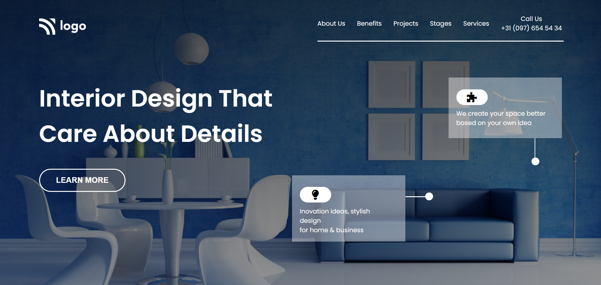

# Project 10

## Project 10 [Live link](https://interiordesignpage.netlify.app/)

- Skills Gained in this project 
    - Learned to use background-image with lienar-gradient.
    

## Time Taken to Complete this project
    - 5 Hours taken to Complete it.

### ScreenShot
